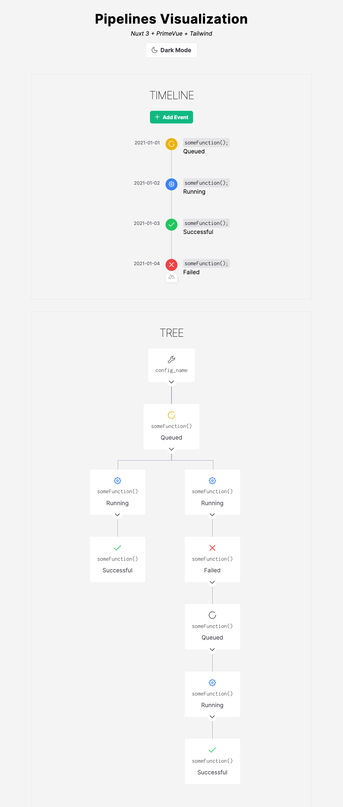

# Research for Visualizing `Workflow-Pipelines`:

This repo is to design, prototype and explore ways to visualize the new `workflow-pipelines` system.

<h3>Builds</h3>

<a href="https://github.com/CHIMEFRB/web-exploration/tree/main/Pipelines%20Visualization/pipelines-viz-vue">Pipelines Visualization using Nuxt (Timeline Style)</a>

