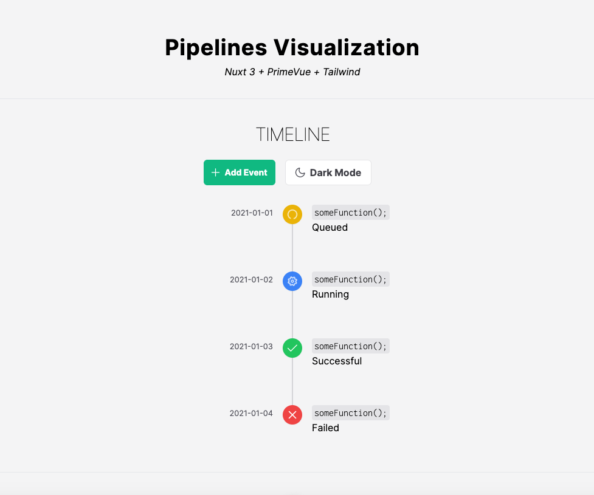
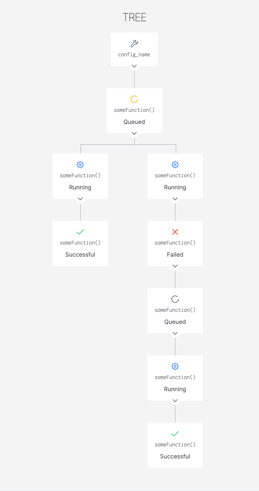

# Pipelines Visualization with Nuxt (Vue3)
<details>
<summary>Development Setup</summary>
Make sure to install the dependencies:

```bash
# bun
bun install
```

### Development Server

Start the development server on `http://localhost:3000`:

```bash
# bun
bun run dev
```

### Production

Build the application for production:

```bash
# bun
bun run build
```

Locally preview production build:

```bash
# bun
bun run preview
```

Check out the [deployment documentation](https://nuxt.com/docs/getting-started/deployment) for more information.

</details>

<div align="center">
<h2>Design</h2>
<h4>Prototype #1</h4>

<h4>Prototype #2</h4>

</div>
cd 
