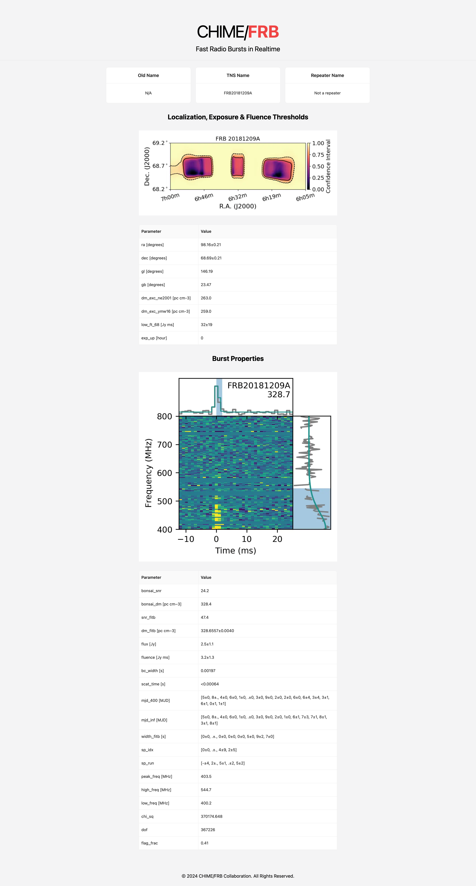

# public-web with Bun, React 19 (Next.js 15), TypeScript, Tailwind & GitHub Primer / Ant Design

<details >
<summary>Setup</summary>

### Getting Started

First, run the development server:

```bash
bun dev
```

Open [http://localhost:3000](http://localhost:3000) with your browser to see the result.

You can start editing the page by modifying `app/page.tsx`. The page auto-updates as you edit the file.

## Learn More
- [Next.js Documentation](https://nextjs.org/docs)
</details>

**Time Spent Coding (setup to finish)**: 3.5 hours.

Extra time spent trying to make Primer Design work properly with React 19, other than that it was smooth sailing.

### Event Page Design:
<div style="text-align: center;">
  
</div>

### Findings:
- Setup was quick, straightforward and easy.
- React 19 Compiler is buggy with Next.js 15, as of yet.
- Much more fine-grained control over everything compared to Vue/Nuxt 3.

#### Primer Design to Ant Design `antd`:
- GitHub Primer Design as a component library is **not** a viable.
    - *Most* of the components are experimental/buggy.
    - It outright does not work with React 19. Max supported is React 18.
    - Out of all the components in it, only 2-3 are in "beta" (usable).

> I substituted to [Ant Design System](https://ant.design/).

#### Thoughts on Ant Design:
- Has pretty much everything we would need, plus more with the pro version.
- Tailwind support is very bad. If we opt for this, SCSS is the way to go for custom styles.
- Works OK with React 19 RC.

> Further alternatives could be Material UI, or our own component library with [Shadcn/ui](https://ui.shadcn.com/).

### Conclusions:
For public-web, the development would definitely be faster/more straightforward with the Vue Stack. However, for bigger codebases React might be the wiser choice.
