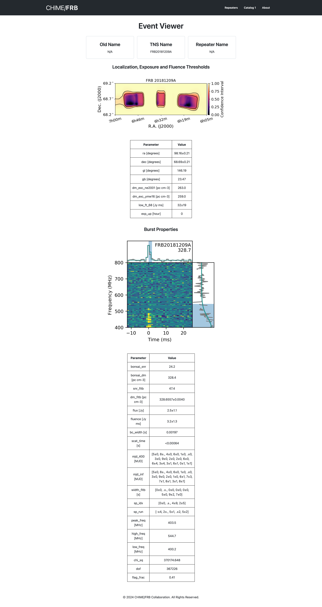

# React 18 + TypeScript + Vite + Primer Design System

- [@vitejs/plugin-react](https://github.com/vitejs/vite-plugin-react/blob/main/packages/plugin-react/README.md) uses [Babel](https://babeljs.io/) for Fast Refresh
- [@vitejs/plugin-react-swc](https://github.com/vitejs/vite-plugin-react-swc) uses [SWC](https://swc.rs/) for Fast Refresh

**Time Spent Coding (setup to finish)**: 3 hours.

### Event Page Design:

  

 

> I had to use the default `Table` element because Primer's `Table` component is still in Experimental phase.

### Findings:
- Primer is mainly CSS-in-JS, using `styled-components`.
- A lot of key components are not completed yet, like `DataTable` and `Image`.
- No support for SSR/Next.js. Vanilla React 18 only.
- If we go with Primer, we would sacrifice features like:
    - Meta frameworks like Next.js and their features.
    - React Server Components
    - Optimized image delivery formats (e.g. `.webp`)
    - SSR alltogether.

### Conclusions:
While Primer Design System's philosophy is great and intuitive, its React implementation is not mature enough to be used in production.
