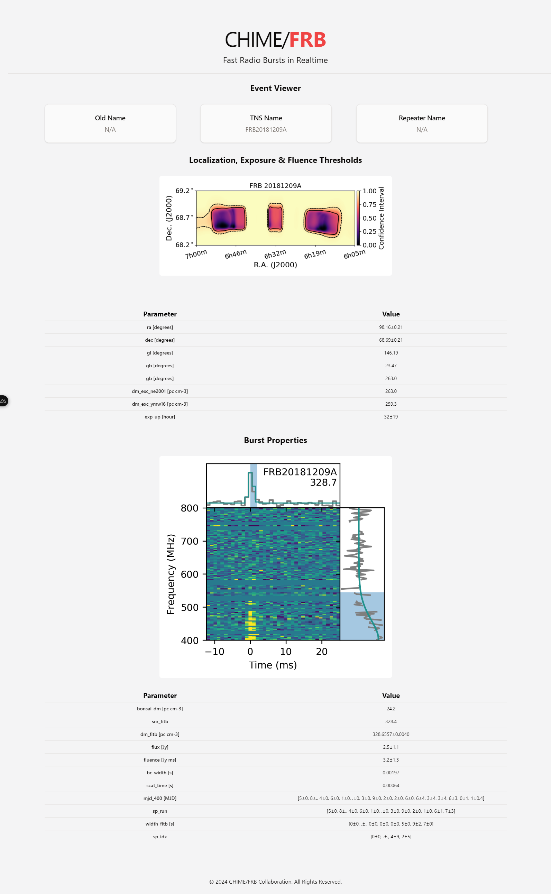

# public-web with Bun, Nuxt (Vue 3), Tailwind & Shadcn

<details >
<summary>Setup</summary>

Make sure to install the dependencies:

```bash
# bun
bun install
```

## Development Server

Start the development server on `http://localhost:3000`:

```bash
# bun
bun run dev
```

## Production

Build the application for production:

```bash
# bun
bun run build
```

Locally preview production build:

```bash
# bun
bun run preview
```
</details>

**Time Spent Coding (setup to finish)**: 2 hours.

### Event Page Design:
<div style="text-align: center;">
  
</div>

### Findings:
- Setup was very quick, straightforward and easy.
- Shadcn is very flexible but barebones. It only offers the very base components to build **your own** UI component library.
- Each component is **fully** customizable, from design to implementation.
- Works *perfectly* with Tailwind out-of-the-box.
- Vue/Nuxt is super easy and fast to work with.
  - Great SSR (server-side rendering) implementation
  - Easy to teach & understand
  - Extremely fast for meta data / SEO optimization.
  - Good DX, things like auto-imports are a big help.

> If we need more from our component library, we can use *primeVue*, which has a *lot* more.
 
> With this, we can easily adapt to any design system/philosophy of choice.

### Conclusions:
Overall, this is a very viable tech stack, especially for a not-so-big codebase like the `public-web`.
